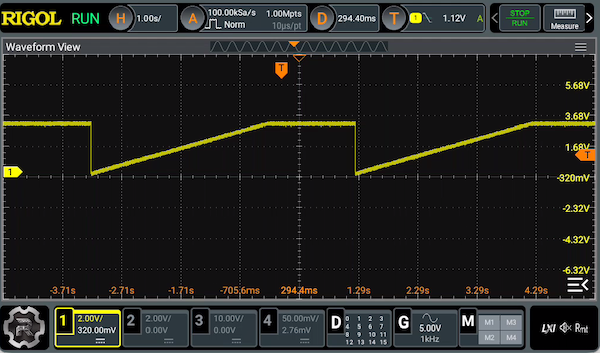

# AD5593R Python Library

This is a Python port of the C++ Arduino library by Rob Tillaart. If you want 
to use the AD5593R with Arduino, check out Rob's excellent library at 
[github.com/RobTillaart/AD5593R](https://github.com/RobTillaart/AD5593R).

The Analog Devices AD5593R I2C expander has 8 I/O pins that can be configured 
as ADC, DAC, or GPIO. It's a very expensive part but it's also extremely 
flexible, making it ideal for specialist devices such as test jigs that must 
be reconfigured to suit different test requirements.

Note: When first powered up, all I/O pins default to 85K pull-downs until 
their mode is specifically set.

This library was created for use with the 
[AD5593R-based I/O module](https://github.com/SuperHouse/IOMOD) 
as part of the 
[Testomatic PCB test jig system](https://github.com/superhouse/testomatic).


## I/O Voltage and VREF

The AD5593R supports dual power domains, with one voltage for control via I2C and 
the other for operation of the I/O pins. They can be the same, or they can be 
different such as using 3.3V I2C to an MCU, and 5V on I/O pins.

When using the DAC and ADC analog functions, the interaction between the VREF value 
and the I/O voltage will determine how the values that you read and write will 
map to actual voltages.

ADC and DAC modes are 12-bit, with full range values of 0-4095. Analog voltages 
are referenced against either an internal 2.5V voltage reference or an 
external precision voltage reference.

When using the internal VREF with the default 1x multiplier, the full DAC output 
range is limited 0-2.5V, ie: writing a value of 0 gives 0V output, and writing 
a value of 4095 gives 2.5V output. When the 2x multiplier is enabled, the values 
are mapped with 0 giving 0V output and 4095 giving 5V output. HOWEVER, the catch 
is that if you are running the I/O voltage domain at (say) 3.3V, the values will 
still map to the entire range but the part of the range above 3.3V will never be 
reached. If you write a value of 2703 you will receive the maximum 3.3V output, 
and any values above that will still only give 3.3V output. This example shows 
the voltage output with 3.3V supply voltage, 2.5V internal VREF, 1x multiplier, 
and output values of 0-4095:



The implication of this is if you want to run the AD5593R at 3.3V I/O and 
achieve full-scale DAC output, you need to either:

 1. Use an external 3.3V precision voltage reference, leave the multiplier at 1x, 
    and use the full range of values from 0-4095, or
 2. Use the internal 2.5V VREF, turn on the 2x VREF multiplier, and map your 
    output values to 0-2703.


## Installation

Install the required dependency:

```bash
pip install -r requirements.txt
```

Or install directly:

```bash
pip install smbus2
```

## Usage

### Basic Setup

```python
from AD5593R import AD5593R, AD5593R_LDAC_DIRECT

# Create instance with I2C address 0x10 (or 0x11)
# bus_number defaults to 1 (for Raspberry Pi)
ad = AD5593R(0x10, bus_number=1)

# Initialize and check connection
if not ad.begin():
    print("AD5593R not found!")
    exit(1)

print(f"Connected: {ad.is_connected()}")
print(f"Address: 0x{ad.get_address():02X}")
```

### Configure Pins

```python
# Set all pins to DAC mode
ad.set_dac_mode(0xFF)

# Or use string configuration: A=ADC, D=DAC, I=INPUT, O=OUTPUT, T=TRISTATE
ad.set_mode("AADDIIOT")  # Configure all 8 pins with specific functions
```

### Reference Voltage

```python
# Use internal reference (2.5V)
ad.set_external_reference(False, 0)

# Use external reference (e.g., 3.3V)
ad.set_external_reference(True, 3.3)

# Configure ranges
ad.set_dac_range_2x(False)  # 1x Vref
ad.set_adc_range_2x(False)  # 1x Vref

# Set LDAC mode (must be called after set_external_reference)
ad.set_ldac_mode(AD5593R_LDAC_DIRECT)
```

### Digital I/O

```python
# Set pin 0 as output
ad.set_output_mode(0x01)

# Write HIGH to pin 0
ad.write1(0, 1)

# Write LOW to pin 0
ad.write1(0, 0)

# Write to all pins at once
ad.write8(0b10101010)

# Set pin 1 as input
ad.set_input_mode(0x02)

# Read pin 1
value = ad.read1(1)

# Read all input pins
all_pins = ad.read8()
```

### Analog I/O

```python
# Write to DAC (12-bit, 0-4095)
ad.write_dac(0, 2048)  # Half scale

# Read back DAC value
value = ad.read_dac(0)

# Read ADC (12-bit, 0-4095)
ad.set_adc_mode(0x01)  # Set pin 0 as ADC
adc_value = ad.read_adc(0)

# Read temperature
temperature = ad.read_temperature()
print(f"Temperature: {temperature:.2f}°C")
```

### Power Management

```python
# Power down entire device
ad.power_down()

# Wake up
ad.wake_up()

# Power down specific DAC
ad.power_down_dac(0)

# Wake up specific DAC
ad.wake_up_dac(0)
```

### Reset

```python
# Software reset (resets Vref to 2.5V and gain to 1x)
ad.reset()
```

### Cleanup

```python
# Close I2C bus when done
ad.close()
```

## Example

See `example_test_dac.py` for an example.

## Differences from Rob Tillaart's Arduino library

This library is directly derived from Rob's work, so his library is a great 
reference if you want to understand more about how the AD5593R works or 
see his examples. I like the way his library operates so I wanted to stay 
consistent with his approach, and things like the names of API calls are mostly 
the same. However, some things were changed to be more Python-ish including:

- Method names use snake_case instead of camelCase (eg: `setMode` is now `set_mode`)
- Constructor takes `bus_number` parameter instead of `TwoWire*` pointer
- Added `close()` method to properly close I2C bus
- Added `get_last_error()` method to check error status

## Error Codes

- `AD5593R_OK` (0x0000): Success
- `AD5593R_PIN_ERROR` (0xFF81): Invalid pin number
- `AD5593R_I2C_ERROR` (0xFF82): I2C communication error
- `AD5593R_LDAC_ERROR` (0xFF83): Invalid LDAC mode

## Notes

- Make sure I2C is enabled on your system! On Raspberry Pi this is done using 
  `sudo raspi-config` -> `Interface Options` -> `I2C`
- Uses `smbus2` for I2C communication
- Default I2C bus is 1 for Raspberry Pi. Modern Raspberry Pi models reserve bus 0 
  for Pi Hat EEPROMs that are read at startup. Use `bus_number=0` for older 
  Raspberry Pi models
- The device supports I2C addresses 0x10 and 0x11, which are set by the A0 pin on 
  the AD5593R

## License

Released under the MIT licence.